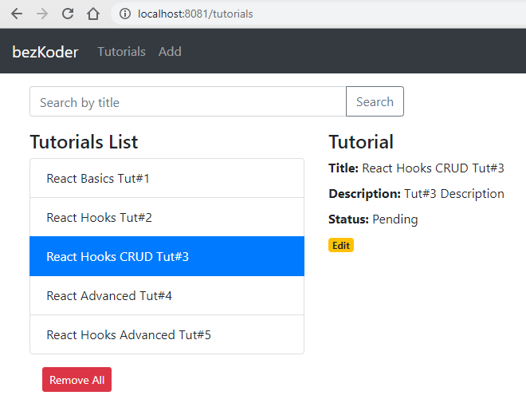

# React.js Hooks CRUD App with Axios & Web API example
Build a React Hooks CRUD Application to consume Web API with Axios, display and modify data with Router & Bootstrap.
- Each Tutorial has id, title, description, published status.
- We can create, retrieve, update, delete Tutorials.
- There is a Search bar for finding Tutorials by title.



For instruction, please visit:
> [React Hooks CRUD example with Axios and Web API](https://bezkoder.com/react-hooks-crud-axios-api/)

More Practice:
> [React Table example: CRUD App with react-table v7](https://bezkoder.com/react-table-example-hooks-crud/)

> [React Pagination using Hooks example](https://bezkoder.com/react-pagination-hooks/)

> [React Hooks File Upload example](https://bezkoder.com/react-hooks-file-upload/)

> [React Hooks: JWT Authentication & Authorization example](https://bezkoder.com/react-hooks-jwt-auth/)

> [React + Redux + Hooks: JWT Authentication & Authorization example](https://bezkoder.com/react-hooks-redux-login-registration-example/)

Fullstack with Node.js Express:
> [React + Node.js Express + MySQL](https://bezkoder.com/react-node-express-mysql/)

> [React + Node.js Express + PostgreSQL](https://bezkoder.com/react-node-express-postgresql/)

> [React + Node.js Express + MongoDB](https://bezkoder.com/react-node-express-mongodb-mern-stack/)

Fullstack with Spring Boot:
> [React + Spring Boot + MySQL](https://bezkoder.com/react-spring-boot-crud/)

> [React + Spring Boot + PostgreSQL](https://bezkoder.com/spring-boot-react-postgresql/)

> [React + Spring Boot + MongoDB](https://bezkoder.com/react-spring-boot-mongodb/)

Fullstack with Django:
> [React.js Hooks + Django Rest Framework](https://bezkoder.com/django-react-hooks/)

Serverless with Firebase:
> [React Firebase Hooks: CRUD App with Realtime Database example](https://bezkoder.com/react-firebase-hooks-crud/)

> [React Hooks Firestore example: CRUD App](https://bezkoder.com/react-hooks-firestore/)

This project was bootstrapped with [Create React App](https://github.com/facebook/create-react-app).

### Set port
.env
```
PORT=8081
```

## Project setup

In the project directory, you can run:

```
npm install
# or
yarn install
```

or

### Compiles and hot-reloads for development

```
npm start
# or
yarn start
```

Open [http://localhost:8081](http://localhost:8081) to view it in the browser.

The page will reload if you make edits.
